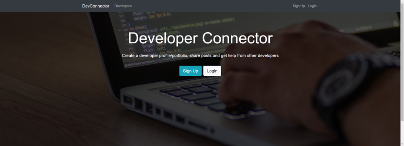
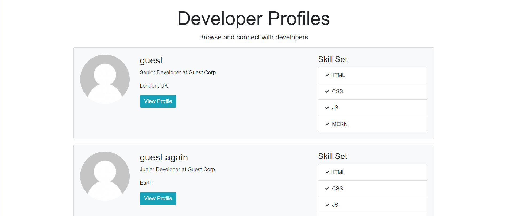
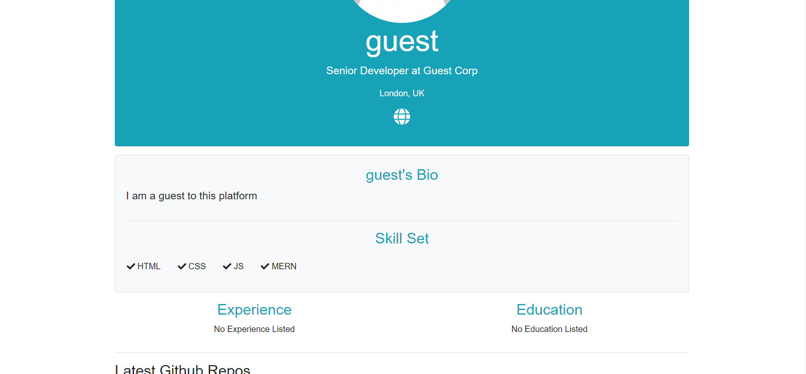

# Dev Connector

## Description
A social network for developers. A pedagogical application built with the MERN stack allowing user to create a developer profile/portfolio, share posts and get help from other developers.  Built with the MERN stack.

##### Homescreen

##### Create Profile View

##### Developer Profiles View

##### Developer Single Profile View

Visit site [here](https://dev-connector-xo.herokuapp.com/).

## Table of Contents
  * [Installation](#installation)
  * [Usage](#usage)
  * [License](#license)
  * [Technologies](#technologies)
  * [Contributing](#contributing)
  * [Testing](#testing)
  * [Questions](#questions)
  
## Installation
Clone project to a directory on your local machine and cd into devConnector directory.  Run <$ npm install> to install dependencies.  See package.json for other available scripts.

## Usage
Run <$ npm run dev> to launch application and launch on localhost development server.  Create a profile or log in guest account with email: 'guest@example.com' and password: 'password123'.  Complete profile forms to add user details.  Add posts.  Leave Comments.  View other developer profiles.

## License 
This project is covered under the MIT license 

## Technologies 
MERN, Redux, React Router, JSON Web Tokens, Passport.js

## Contributing
To see the guidelines adopted for contributing to this project, please view the [Contributor Covenant](https://www.contributor-covenant.org/version/2/0/code_of_conduct/code_of_conduct.txt)

## Testing
Tests coming soon

## Questions
Visit me at GitHub  
[christopherConcannon](https://github.com/christopherConcannon)
  
If you have any questions or would like to contact me, please email me at  
[cmcon@yahoo.com](mailto:cmcon@yahoo.com)
